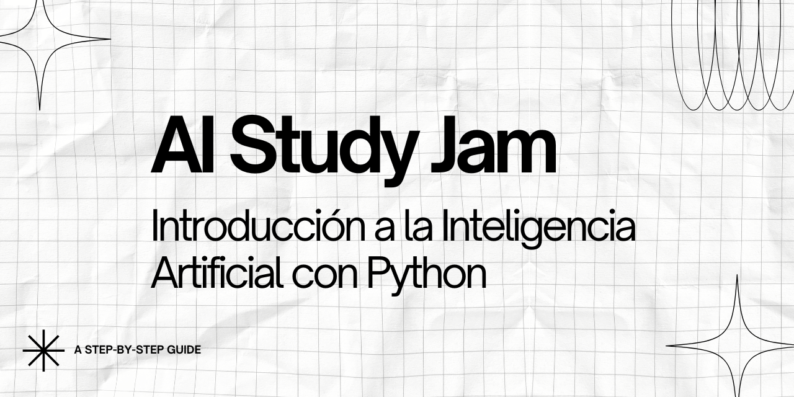

# AI Study Jam: Introducción a la Inteligencia Artificial con Python

¡Bienvenidos al repositorio oficial del **AI Study Jam**! Este espacio contiene todo el material didáctico necesario para iniciarte en el fascinante mundo de la Inteligencia Artificial utilizando Python.

## 🚀 Acerca del Study Jam

Este Study Jam está diseñado para principiantes que ya tienen conocimientos básicos de programación y desean adentrarse en el campo de la Inteligencia Artificial. A través de sesiones prácticas y ejemplos concretos, aprenderás los fundamentos de la IA y comenzarás a desarrollar tus propios modelos.

## 📋 Prerequisitos

- Conocimientos básicos de programación
- Python instalado (recomendamos Python 3.8+)
- Entusiasmo por aprender sobre IA

## 🛠️ Instalación

Para comenzar, clona este repositorio:

```bash
git clone https://github.com/holasoymalva/AI-Study-Jam.git
cd AI-Study-Jam
```

Instala las dependencias necesarias:

```bash
pip install -r requirements.txt
```

## 📚 Contenido del Study Jam

### Módulo 1: Fundamentos de IA
- [Introducción a la Inteligencia Artificial](./01-module/01_introduccion.md)
- [Tipos de Aprendizaje Automático](./01-module/02_tipos_aprendizaje.md)
- [Preparación del entorno de trabajo](./01-module/03_entorno_trabajo.md)

### Módulo 2: Manipulación de Datos con Python
- [Introducción a NumPy](./02-module/01_numpy_intro.md)
- [Manejo de datos con Pandas](./02-module/02_pandas_basico.md)
- [Visualización de datos con Matplotlib y Seaborn](./02-module/03_visualizacion.md)

### Módulo 3: Aprendizaje Supervisado (En desarrollo)
- [Regresión Lineal]
- [Regresión Logística](./modulo3/02_regresion_logistica.ipynb)
- [Árboles de Decisión](./modulo3/03_arboles_decision.ipynb)
- [Evaluación de Modelos](./modulo3/04_evaluacion_modelos.ipynb)

### Módulo 4: Aprendizaje No Supervisado (En desarrollo)
- [Clustering con K-Means](./modulo4/01_kmeans.ipynb)
- [PCA: Análisis de Componentes Principales](./modulo4/02_pca.ipynb)
- [Casos prácticos](./modulo4/03_casos_practicos.ipynb)

### Módulo 5: Introducción a las Redes Neuronales (En desarrollo)
- [Fundamentos de Redes Neuronales](./modulo5/01_fundamentos_nn.ipynb)
- [Implementación con TensorFlow/Keras](./modulo5/02_tensorflow_keras.ipynb)
- [Proyecto: Clasificación de imágenes](./modulo5/03_proyecto_clasificacion.ipynb)

## 🧪 Proyectos Prácticos (En desarrollo)

En la carpeta [`/proyectos`](./proyectos) encontrarás una serie de proyectos prácticos para aplicar lo aprendido:

1. [Predicción de precios de viviendas](./proyectos/01_prediccion_precios.ipynb)
2. [Clasificación de correos (spam/no spam)](./proyectos/02_clasificacion_correos.ipynb)
3. [Segmentación de clientes](./proyectos/03_segmentacion_clientes.ipynb)
4. [Reconocimiento de dígitos escritos a mano](./proyectos/04_reconocimiento_digitos.ipynb)

## 📊 Datasets

Los datasets necesarios para los ejercicios y proyectos se encuentran en la carpeta [`/datasets`](./datasets). Para conjuntos de datos más grandes, proporcionamos enlaces para su descarga.

## 🤝 Contribuciones

¡Las contribuciones son bienvenidas! Si deseas mejorar este material didáctico:

1. Haz un fork del repositorio
2. Crea una nueva rama (`git checkout -b mejora-modulo2`)
3. Realiza tus cambios y haz commit (`git commit -m 'Agrega ejemplos al módulo 2'`)
4. Sube tus cambios (`git push origin mejora-modulo2`)
5. Abre un Pull Request

## 📝 Notas de las Sesiones

Después de cada sesión del Study Jam, publicaremos notas y recursos adicionales en la carpeta [`/notas`](./notas).

## 📜 Licencia

Este proyecto está bajo la licencia MIT - consulta el archivo [LICENSE](LICENSE) para más detalles.

## 📞 Contacto

Si tienes preguntas o sugerencias, no dudes en:
- Abrir un issue en este repositorio
- Contactar a [@holasoymalva](https://github.com/holasoymalva)

---

⭐ **¡No olvides dar una estrella a este repositorio si te resulta útil!** ⭐

Feliz aprendizaje y ¡bienvenido al fascinante mundo de la Inteligencia Artificial!
